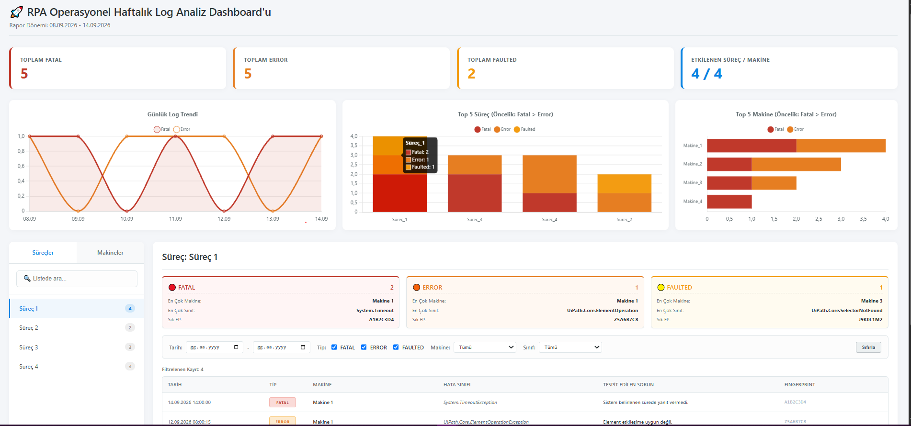

# Kurumsal RPA Analitik ve Operasyonel Raporlama 📊🤖

## Proje Özeti
Bu repo, Kurumsal RPA (Robotik Süreç Otomasyonu) süreçleri için geliştirilmiş otomatik operasyonel rapor ve dashboard şablonlarını içermektedir. Raporlar, **UiPath Orchestrator REST API** üzerinden çekilen log ve kuyruk (queue) verilerinin işlenmesiyle dinamik olarak oluşturulmakta ve ilgili IT/İş birimlerine HTML formatında otomatik olarak iletilmektedir.

> **Not:** Kurumsal gizlilik ve şirket politikaları (NDA) gereği, bu şablonlardaki tüm veriler (süreç adları, makine isimleri, işlem sayıları) maskelenmiş ve dummy (örnek) verilerle değiştirilmiştir.

## Temel Özellikler ve Ölçülen Metrikler

* **Kuyruk (Queue) Performans Analizi:** İşlemlerin başarı oranları, kayıp zaman hesaplamaları (AppException ve Retry kaynaklı) ve haftalık performans trendleri.
* **Operasyonel Log Analizi:** Hataların makine, süreç ve hata sınıfı (Fatal, Error, Faulted) bazında segmente edilerek kök neden (root-cause) analizinin hızlandırılması.
* **Orchestrator Sağlık Taraması (Health Check):** Kullanılmayan asset/queue'ların, proje paket versiyon uyuşmazlıklarının ve konfigürasyon hatalarının otomatik tespiti.
* **Süreç Tetikleyici (Trigger) Analizi:** Manuel ve otomatik (zamanlanmış/kuyruk) tetiklenme oranlarının analizi.

## 🔗 Canlı Rapor Önizlemeleri
*(Eğer GitHub Pages kullanırsan buraya tıklanabilir linkleri koyabilirsin. Şimdilik dosyaların repo içindeki linklerini bırakıyoruz)*

* 📊 [Queue Performans Raporu](RPA İleri Düzey Queue Dashboardu.html)
* 📈 [Operasyonel Log Analizi](Operasyonel_Log_Analiz_Raporu_Mail.html)
* ⚙️ [Orchestrator Kontrol Raporu](Orchestrator_Kontrol_Raporu_Mail.html)
* ⏱️ [Süreç Tetikleyici Raporu](Surec_Tetikleyici_Raporu_Mail.html)

## Kullanılan Teknolojiler
* **Veri Çekme:** UiPath Orchestrator REST API
* **Veri İşleme:** UiPath Studio, Data Tables, LINQ
* **Raporlama ve Görselleştirme:** HTML5, Inline CSS (MS Outlook uyumlu)

## Sağlanan Katma Değer
Bu raporlama mimarisi sayesinde, RPA yönetim ekibi manuel log kontrollerinden kurtularak **proaktif bir izleme (monitoring)** modeline geçiş yapmıştır. Hatalara müdahale süresi kısalmış ve iş birimlerine süreçlerinin performansı hakkında şeffaf metrikler sunulmuştur.

---
### Raporlardan Detaylar

*Makine ve hata sınıfı bazlı operasyonel log kırılımı.*

*Orchestrator üzerindeki atıl (kullanılmayan) nesnelerin tespiti.*
