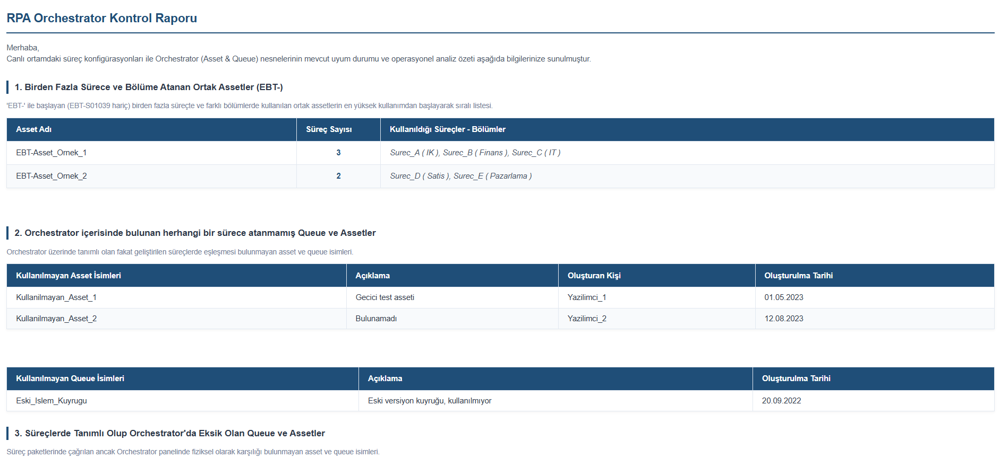

# Kurumsal RPA Analitik ve Operasyonel Raporlama 📊🤖

## Proje Özeti
Bu repo, bankacılık sektöründe Kurumsal RPA (Robotik Süreç Otomasyonu) süreçleri
için geliştirilmiş **7 adet** otomatik operasyonel rapor ve interaktif dashboard
şablonunu içermektedir.

Raporlar, **UiPath Orchestrator REST API** üzerinden çekilen log, kuyruk (queue)
ve konfigürasyon verilerinin işlenmesiyle dinamik olarak oluşturulmaktadır.

> **Not:** Kurumsal gizlilik (NDA) gereği tüm veriler maskelenmiş
> ve örnek verilerle değiştirilmiştir.

## Rapor Mimarisi

Bu projede iki farklı rapor türü geliştirilmiştir:

| Tür | Açıklama | Teknoloji |
|---|---|---|
| **📧 Mail Raporları** | E-posta gövdesine gömülen statik HTML raporlar. Outlook uyumlu inline CSS. | HTML5, Inline CSS |
| **📊 İnteraktif Dashboard'lar** | Filtrelenebilir, grafikli SPA (Single Page Application) yapısında dashboard'lar. Mail ekinde gönderilir. | HTML5, CSS, JavaScript, Chart.js |

---

## 📊 İnteraktif Dashboard'lar (3 Adet)

### 1. Haftalık Log Analiz Dashboard'u
Haftalık operasyonel hata trendlerini interaktif olarak analiz eder.

**Öne Çıkan Özellikler:**
- Chart.js ile günlük Fatal/Error trend grafiği (Line Chart)
- Top 5 Süreç ve Top 5 Makine sıralaması (Stacked Bar Chart)
- Süreç ↔ Makine çift yönlü dinamik matris (mod değiştirince sütunlar otomatik değişir)
- Sidebar'dan süreç/makine seçimi, anlık arama ve çoklu filtre paneli
- Tarih, seviye (Fatal/Error/Faulted), hata sınıfı bazlı filtreleme

**Takip Edilen Metrikler:** Toplam Fatal/Error/Faulted, etkilenen süreç ve makine
sayısı, en sık tekrarlanan hata sınıfı ve fingerprint dağılımı.

---

### 2. Aylık Log Analiz Dashboard'u
Haftalık dashboard'un aylık versiyonu — uzun vadeli operasyonel trend analizi sunar.

**Fark:** Veri seti 30 günlük periyodu kapsar, aylık operasyonel raporlama
toplantıları için tasarlanmıştır.

---

### 3. İleri Düzey Queue Dashboard'u
Robot performansını işlem hacmi, hız ve efor perspektifinden analiz eder.

**Öne Çıkan Özellikler:**
- Yönetici KPI kartları (Toplam İşlenen, Kritik Hata, Başarı Oranı, Retry Kurtarılan)
- İşlem Hacmi dağılımı (Doughnut Chart)
- Üretken vs Kayıp Efor karşılaştırması (Yatay Stacked Bar — saat bazında)
- Süreç bazlı "Bu Hafta vs Geçen Hafta" günlük karşılaştırmalı grafikler
- 3 detay tablosu: Kuyruk Performansı, Hız & Efor Özeti, Retry Analizi

**Takip Edilen Metrikler:**
- Başarı Oranı Formülü: `(Başarılı + BizEx) / Tamamlanan İşlemler`
- Kayıp Efor: AppException + Retry sürelerinin ayrıştırılmış hesabı
- Hız Trendi: Ortalama işlem süresi değişimi (Hızlandı / Yavaşladı / Stabil)
- Retry Dayanıklılığı: Kurtarılan transaction oranı ve boşa harcanan süre

---

## 📧 Mail Raporları (4 Adet)

### 4. Haftalık Queue Performans Raporu
Tüm kuyrukların haftalık durumunu tek bir e-postada özetler.

**Öne Çıkan Özellikler:**
- Kural tabanlı otomatik alarm kutuları (renk kodlu):
  - 🛑 Kritik başarı oranı düşüşleri
  - ⏸️ Asılı kalan (In Progress) işlem uyarıları
  - ⏳ Yüksek efor kaybı bildirimleri
  - ⚙️ Haftalık hata artış alarmları
  - ⏱️ Performans yavaşlama tespitleri
- 3 detay tablosu: Performans Özeti, Hız Analizi, Retry Analizi

---

### 5. Operasyonel Log Analiz Raporu
Hata loglarını 3 farklı boyutta analiz eder.

**Öne Çıkan Özellikler:**
- 3 boyutlu çapraz matris analizi:
  - I. Makine Bazlı Özet (makine → en çok hata veren süreç ve hata sınıfı)
  - II. Süreç Bazlı Özet (Fatal / Faulted / Error ayrımı)
  - III. Hata Sınıfı Bazlı Özet (exception → en çok etkilenen makine ve süreç)
- Gürültü azaltma filtresi: ERROR loglarında `Toplam >= 10` eşiği

---

### 6. Orchestrator Kontrol Raporu (Sağlık Taraması)
Orchestrator konfigürasyonunu proaktif olarak denetler.

**Kontrol Edilen Alanlar:**
1. Birden fazla sürece atanmış ortak asset bağımlılıkları
2. Hiçbir sürece atanmamış atıl asset ve queue tespiti
3. Süreç kodunda tanımlı olup Orchestrator'da eksik olan nesneler
4. `project.json` adı ile Orchestrator süreç adı uyuşmazlıkları
5. Klasörlerde tekrarlanan (duplicate) süreç dosyaları
6. Paket sürüm yaşı analizi (4+ yıl eski paketler)

---

### 7. Süreç Tetikleyici Raporu
Süreçlerin otomasyon olgunluğunu ve insan müdahalesini ölçer.

**Öne Çıkan Özellikler:**
- Tetikleyici türü dağılımı: Time Trigger / Queue Trigger / Manual Trigger
- Manuel oran hesaplaması ve renk kodlu eşik görselleştirmesi
  (>%80 Kırmızı, %60 Turuncu, %30 Sarı, <%10 Nötr)
- Kullanıcı bazlı denetim izi: Kim, hangi süreci, kaç kere manuel tetiklemiş

---

## Kullanılan Teknolojiler
| Alan | Teknoloji |
|---|---|
| Veri Çekme | UiPath Orchestrator REST API |
| Veri İşleme | UiPath Studio, Data Tables, LINQ |
| Dashboard | HTML5, CSS3, JavaScript, Chart.js |
| Mail Raporlama | HTML5, Inline CSS (MS Outlook uyumlu) |

## Sağlanan Katma Değer
Bu raporlama mimarisi sayesinde, RPA yönetim ekibi manuel log kontrollerinden
kurtularak **proaktif bir izleme (monitoring)** modeline geçiş yapmıştır.
Hatalara müdahale süresi kısalmış ve iş birimlerine süreçlerinin performansı
hakkında şeffaf metrikler sunulmuştur.
